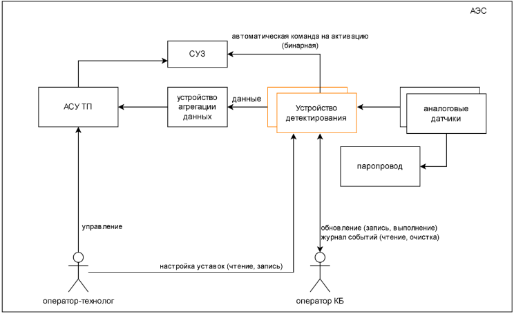
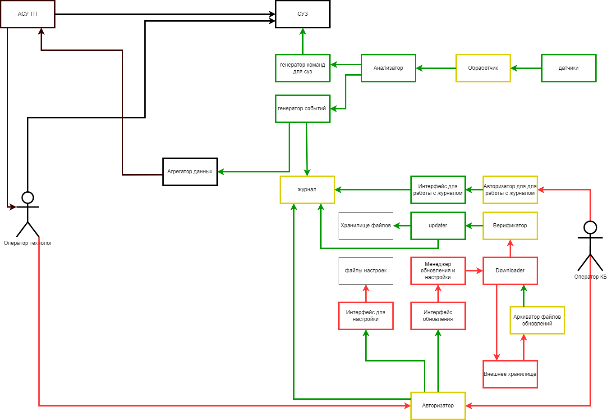

# Отчёт о выполнении задачи "Создание программы для обнаружения повышенного радиационного фона в трубах с паром на атомной электростанции"

- [Отчёт о выполнении задачи "Создание программы для обнаружения повышенного радиационного фона в трубах с паром на атомной электростанции"](#отчёт-о-выполнении-задачи-Создание программы для обнаружения повышенного радиационного фона в трубах с паром на атомной электростанции)
  - [Постановка задачи](#постановка-задачи)
  - [Известные ограничения и вводные условия](#известные-ограничения-и-вводные-условия)
    - [Цели и Предположения Безопасности (ЦПБ)](#цели-и-предположения-безопасности-цпб)
  - [Архитектура системы](#архитектура-системы)
    - [Компоненты](#компоненты)
    - [Алгоритм работы решения](#алгоритм-работы-решения)
    - [Описание Сценариев (последовательности выполнения операций), при которых ЦБ нарушаются](#описание-сценариев-последовательности-выполнения-операций-при-которых-цб-нарушаются)
    - [Указание "доверенных компонент" на архитектурной диаграмме.](#указание-доверенных-компонент-на-архитектурной-диаграмме)
    - [Политики безопасности](#политики-безопасности)
  - [Запуск приложения и тестов](#запуск-приложения-и-тестов)
    - [Запуск приложения](#запуск-приложения)
    - [Запуск тестов](#запуск-тестов)

## Постановка задачи

Рассматриваемое устройство детектирования (УД) обрабатывает входящие
сигналы от датчиков, в случае превышения порога срабатывания
принимает решение о выдаче команды в систему управления защиты
(СУЗ) реактора (автоматическое срабатывание).

УД передаёт обработанные данные в автоматизированную систему
управления технологическим процессом (АСУ ТП) АЭС для дальнейшей
обработки, на основе этих данных оператор АСУ ТП может принять
решение о выдаче команды в СУЗ (административное срабатывание)
Вторичные функции
- УД сохраняет во встроенном журнале события



## Известные ограничения и вводные условия

1. Данные от внешнего окружения передаются по HTTP
2. Данные на внешние устройства передаются по HTTP по REST API.
3. Монитор безопасности и брокер сообщения явялются защищенными

## События безопасности

1. превышение входным сигналом порога предупреждения
2. превышение входным сигналом порога аварии
3. активация режима обновления системы
4. активация режима изменения настроек
5. изменение порога предупреждения
6. изменение порога аварии


### Цели и Предположения Безопасности (ЦПБ)
Цели безопасности:

1. Только авторизованный оператор-технолог в присутствии
оператора-безопасника может инициировать изменение настроек УД
2. Только авторизованный оператор-безопасник в присутствии
оператора-технолога может обновлять ПО УД
3. УД выдаёт целостные и достоверные данные во внешние системы с
задержкой не более 1 секунды в предположении, что операционная
система удовлетворяет требованиям обработки данных в реальном
времени
4. Только авторизованный оператор-безопасник удаляет и читает содержимое журнала
5. Устанавлиется только верифицированная прошивка

Предположения безопасности:

- не рассматриваются атаки, связанные с физическим доступом к
оборудованию (например, подмена входных данных; подключение
имитатора УД и т.п.)
- не рассматриваются риски, связанные с физическим отказом внешнего
оборудования, включая обесточивание УД
- не рассматриваются риски, связанные с физическим отказом
аппаратного обеспечения устройства

## Архитектура системы

### Компоненты

| Название | Назначение | Комментарий |
|----|----|----|
|*hendler* | Обработчик входящего потока данных с *sensor*.  Принимает POST-запросы с показателями и передает их внутрь системы УД | - |
|*analyser* | Анализатор полученных показателей. Входящие данные сравниваются с уровнем предупреждения и уровнем тревоги. В случае превышения порога уровня тревоги, отправляет событие в генератор команд (*commander*). Все события анализа перенатпрявляются в генератор событий (*gen_event*)  | - |
|*commander* | На основе входящих событий безопасности оптравляет бинарную команду на *protection_system* | - |
|*gen_event* | Создает и отправляет события безопасности в журнал УД и АСУ ТП (*scada*) | - |
|*journal* | Принимает входящие события от генератора событий и авторизаторов. Хранит в себе события безопасности | - |
|*Авторизатор для работы с журналом* | Авторизует оператора-безопасника по входящему ключу | - |
|*Авторизатор* | Принимает на вход два ключа операторов, авторизует их. Отправляет событие в журнал  | - |
|*manager* | После авторизации операторов отпраляет команду в *downloader* для скачивания обновления с *file_server* | - |
|*Архиватор* | Шифрует файл обновления при скачивании с *file_server*. Для шифрования использует внутренний ключ, устройства | - |
|*verifier* | Принимает зашифрованный файл обновления, расшифровывает его и применяет алгоритмы статического анализа кода для проверки на угрозы  | - |
|*updater* | Устанавливает файл обновления на устройство. Документирует событие в журнале  | - |
|*file_server* | Поскольку в реализации подразумевалось, что инженеры загружают обновление напрямую в устройство, то для эмуляции этого процесса был использован данный компонент. Его стоит рассматривать как подключенное к device устройство, с которого при успешной аутентификации ключей скачивается на device обновление. Поэтому в т.ч. обладает своей памятью в ./data, где и лежит "обновление". | - |
|*protection_system* | Эмулятор системы защиты станции. При выявлении превышающего порог значения в УД, сюда отправляется сообщение, чтобы "сработала" защита. | - |
|*scada*  | Эмулятор пульта управления станцией. Получает все данные (значения, сообщения об ошибках и т.д.) от УД.  | - |
|*sensor* | Эмулятор аналогового датчика, который раз в заданное время подает сгенерированный в заданном диапазоне сигнал через HTTP в УД.  | - |
|*storage* | Фактически это лишь папка с данными, которая является эмулятором некоторой физической памяти устройства УД. | - |

### Алгоритм работы решения
1. Срабатывание системы защиты


2. Сценарий генерации событий


3. Установка обновления


### Описание Сценариев (последовательности выполнения операций), при которых ЦБ нарушаются


**Отдельная диаграмма для первого негативного сценария - Verifier не проверил файл обновления:**


Нарушение ЦБ №5 - установлена неверифицированная прошивка

**Отдельная диаграмма для второго негативного сценария - Авторизатор не проверил ключи операторов:**


Нарушение ЦБ №2


### Указание "доверенных компонент" на архитектурной диаграмме.




### Политики безопасности 


```python {lineNo:true}
    if  src == 'downloader' and dst == 'manager' \
        and operation == 'download_done':
        authorized = True    
    if src == 'manager' and dst == 'downloader' \
        and operation == 'download_file':
        authorized = True    
    if src == 'downloader' and dst == 'archiver' \
        and operation == 'file_archive':
        authorized = True    
    if src == 'downloader' and dst == 'verifier' \
        and operation == 'verification_requested':
        authorized = True    
    if src == 'verifier' and dst == 'updater' \
        and operation == 'handle_verification_result' \
        and details['verified'] is True:
        authorized = True    
    if src == 'updater' and dst == 'journal' \
        and operation == 'update_event':
        authorized = True      
    if src == 'verifier' and dst == 'storage' \
        and operation == 'get_blob':
        authorized = True
    if src == 'storage' and dst == 'verifier' \
        and operation == 'blob_content':
        authorized = True    
    if src == 'updater' and dst == 'storage' \
        and operation == 'get_blob':
        authorized = True
    if src == 'storage' and dst == 'updater' \
        and operation == 'blob_content':
        authorized = True
    if src == 'hendler' and dst == 'analyser' \
        and operation == 'new_input':
        authorized = True
    if src == 'analyser' and dst == 'gen_event' \
        and operation == 'event_security':
        authorized = True
    if src == 'gen_event' and dst == 'journal' \
        and operation == 'event_security':
        authorized = True
```

## Запуск приложения и тестов

### Запуск приложения

см. [инструкцию по запуску](README.md)
